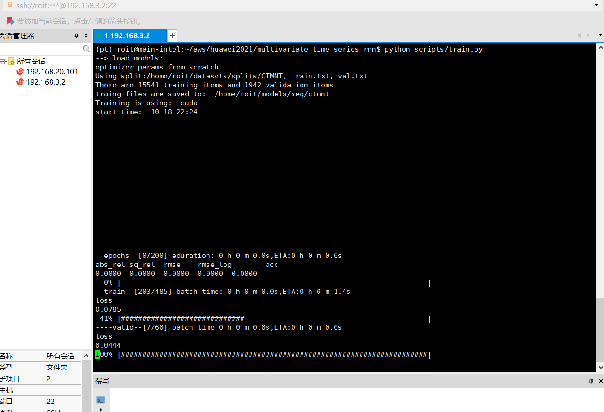
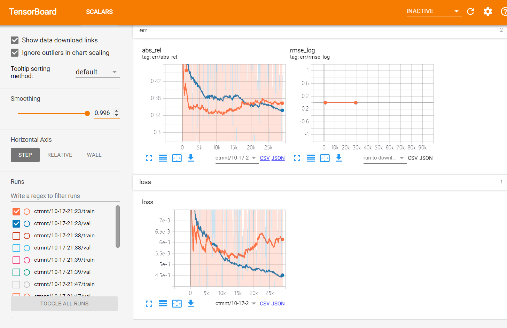

# 华为杯2021数学建模B题

主要包含两个部分, 一部分是B题中用到的部分计算程序:[problems]() 

另一部分是深度学习模型例如rnn, lstm用到的训练程序: [multivariate_time_series_rnn](), 现在对程序结构比较复杂的多元时间序列rnn 程序进行简单介绍

## 1. multivariate_time_series_rnn 介绍

我们用了两个深度学习模型rnn和lstm,

- `./multivariate_time_series_rnn/networks` 

模型构造文件,包含用到的rnn和lstm

- `./multivariate_time_series_rnn/opts/*.yaml`

文件来训练的过程的设置, 例如训练轮数, 模型选择等.

- `./multivariate_time_series_rnn/dataset`

放置了给定的气象&污染物表格数据的载入程序, 能够灵活调整数据形式，有监督训练模型

- `./multivariate_time_series_rnn/scripts`

可执行python文件

- `./multivariate_time_series_rnn/splits`

数据集索引


## 2. multivariate_time_series_rnn 应用

    note:首先通过 ./problems下数据预处理程序将数据集整理好

- 实验平台重要的依赖项
```
pytorch 1.5.1
cuda 10.1
tensorboardX
```

- 训练
 
 编辑 `opts/*.yaml`文件然后
  `python scripts/train.py`。
如果设置正确， 终端如下所示



- 可视化过程

跟踪到 `*.yaml`文件里的`log_dir`然后

`tensorboard --logdir=.`

浏览器打开`127.0.0.1:6006`观看训练时损失函数变化以及模型的绝对误差*AbsRel*曲线变化，如下图所示



